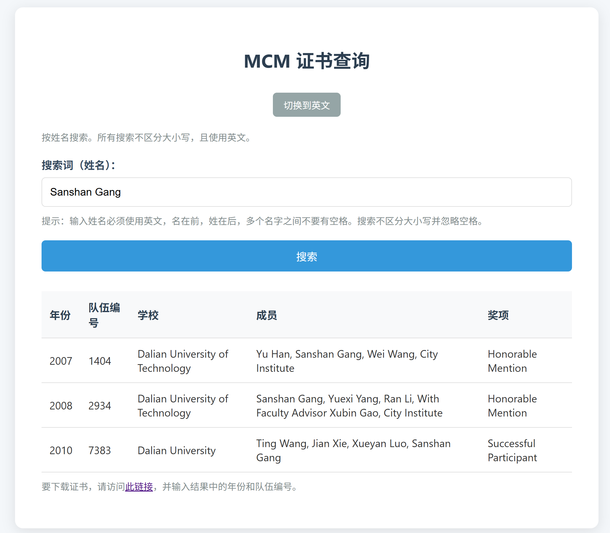
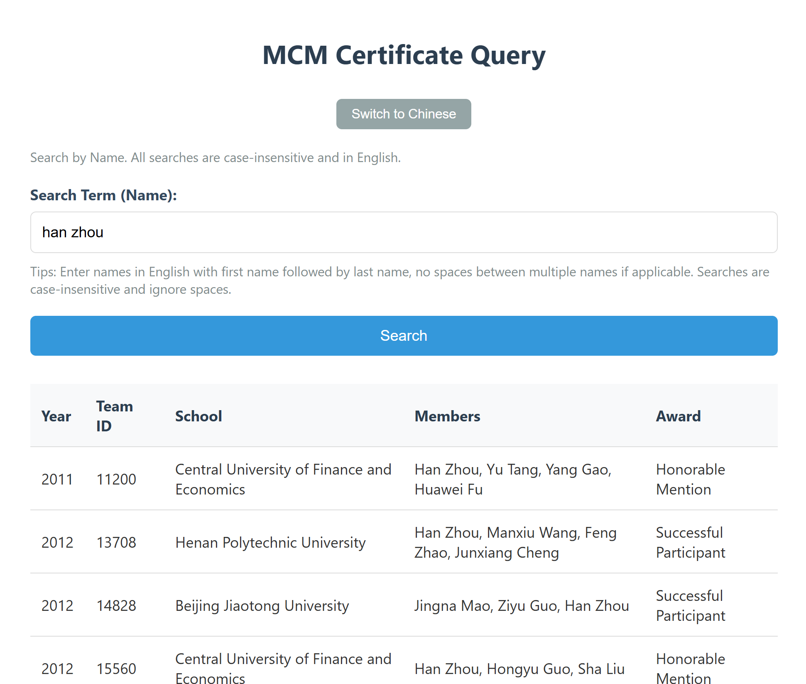

# MCM-Certificate-Query

## 简介

这个仓库提供了一个简单的网页工具，用于通过参赛队员姓名查询美国大学生数学建模竞赛（MCM）的队伍编号和参赛信息，从而实现基于姓名的证书下载功能。起因是MCM官网仅支持通过队伍编号查询和下载证书，但很多年后参赛者往往忘记了自己的队伍编号。这个工具通过解析历史证书数据，帮助用户快速找回相关信息。

## 使用方式

1. 克隆或下载本仓库到本地。 
2. 在仓库目录下，打开命令行终端，输入以下命令启动本地服务器：`python -m http.server 8000`
3. 在浏览器中输入 `localhost:8000`，这会打开 `index.html` 文件
4. 界面中输入姓名（英文格式，名在前姓在后，无空格），点击“搜索”按钮即可查询参赛信息
5. 查询结果包括年份、队伍编号、学校、成员和奖项。查询后，界面会显示下载链接，点击可跳转到MCM官网输入年份和编号下载证书

## 支持范围

- 支持查询2007年至2024年的MCM参赛信息。 
- 注意：数据来源于证书的OCR识别，可能存在个别识别错误，导致某些信息查询不到。如果查询无结果，请尝试调整姓名拼写或检查数据完整性。

## 下载证书

查询到队伍编号后，界面会显示链接：[MCM官网证书下载页面](https://www.contest.comap.com/Certform/index.html)。点击链接，输入查询结果中的年份和队伍编号，即可下载证书。

## 示例截图

## 许可证

本仓库采用 MIT 许可证。数据来源于公开MCM证书，仅用于个人查询目的，请勿用于商业用途。